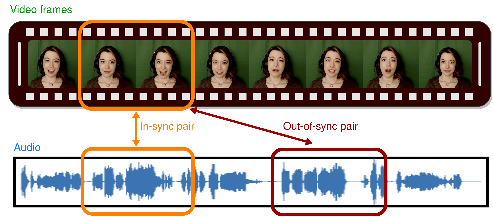

# VocaLiST: An Audio-Visual Synchronisation Model for Lips and Voices
[[Project Page]](https://ipcv.github.io/VocaLiST/) [[Arxiv]](https://arxiv.org/abs/2204.02090) [[Weights]](https://drive.google.com/drive/folders/1-g4qHUNNcCZpmSqEflKMxPMvwnn9e88N?usp=sharing)

Official repository for the paper VocaLiST: An Audio-Visual Synchronisation Model for Lips and Voices. 

The paper has been accepted to Interspeech 2022.

<div class="center" style="text-align: center">
    <div class="center col-md-8" style="text-align: center">
        
    </div>
</div>

### Datasets
There are 2 datasets involved in this work: i) The AV speech dataset of LRS2, 
and ii) the AV singing voice dataset of Acappella.
The LRS2 dataset can be requested for download [[here]](https://www.robots.ox.ac.uk/~vgg/data/lip_reading/lrs2.html).
The Acappella dataset can be downloaded by following the steps mentioned [[here]](https://ipcv.github.io/Acappella/acappella/).

### Preprocessing
All the models considered in this work operate on audios sampled at 16kHz 
and videos with 25fps. The preprocessing steps are the same as in 
https://github.com/Rudrabha/Wav2Lip/blob/master/preprocess.py. The objective 
of the preprocessing step is to obtain the cropped RGB face frames of size 3x96x96 
in the .jpg format and audios of 16kHz sampling rate for each of the video samples in respective datasets.

### Training
To train the VocaLiST model on LRS2 dataset, run the program train_vocalist_lrs2.py.
To train on Acappella dataset, run the program train_vocalist_acappella.py.
Please remember to change the paths to save the checkpoint and the dataset related paths accordingly.
Note that, by default, models are trained to detect synchronization in a context of 
5 frames, which corresponds to audio of 3200 elements. To change the 
context length, it is also necessary to change the length of audio, accordingly.


### Testing
To test the models, first download the pretrained model weights from [[here]](https://drive.google.com/drive/u/0/folders/1-g4qHUNNcCZpmSqEflKMxPMvwnn9e88N).
To test on LRS2, run the program test_lrs2.py. 
To test on Acappella dataset, run the program test_acappella.py.
If you wish to evaluate on Acappella dataset only for a particular context, 
run the program test_acappella_specific.py. Please remember to change the paths to the 
pretrained weights and the dataset related paths accordingly.

### Acknowledgements

The evaluation code is adapted from  Out of time: automated lip sync in the wild. 
The training  code and the experiment configuration setup is borrowed or adapted from that of A Lip Sync Expert Is All You Need for Speech to Lip Generation In the Wild.
The code for internal components of the transformer block is borrowed from
that of the work Multimodal Transformer for Unaligned Multimodal Language Sequences.

### NEW RELATED WORKS !!!

[[MTDVocaLiST]](https://arxiv.org/abs/2210.15563), a lightweight variant of VocaLiST has been proposed which claims to reduce the VocaLiST model size by a whopping **83.52%**, yet still maintaining similar performance. The ([[Source Code]](https://github.com/xjchenGit/MTDVocaLiST)!!!) has also been made available for the same. If you are interested in VocaLiST, we encourage you to check out [[MTDVocaLiST]](https://arxiv.org/abs/2210.15563) as well.


### Citation

If you find our work useful, please consider citing
```
@inproceedings{kadandale2022vocalist,
  title={VocaLiST: An Audio-Visual Synchronisation Model for Lips and Voices},
  author={Kadandale, Venkatesh S and Montesinos, Juan F and Haro, Gloria},
  booktitle={Interspeech},
  pages={3128--3132},
  year={2022}
}

@INPROCEEDINGS{10446372,
  author={Chen, Xuanjun and Wu, Haibin and Wang, Chung-Che and Lee, Hung-Yi and Jang, Jyh-Shing Roger},
  booktitle={ICASSP 2024 - 2024 IEEE International Conference on Acoustics, Speech and Signal Processing (ICASSP)}, 
  title={Multimodal Transformer Distillation for Audio-Visual Synchronization}, 
  year={2024},
  volume={},
  number={},
  pages={7755-7759},
  doi={10.1109/ICASSP48485.2024.10446372}
}
```

### License
This project makes use of source code of other existing works. 
Only the original source code from this repository is provided under CC-BY-NC license, 
while the parts of the repository based on the code reused/adapted from elsewhere 
are available under their respective license terms. 
The code for evaluation setup is adapted from the source code of the paper 
''Out of time: automated lip sync in the wild'' which is made available under https://github.com/joonson/syncnet_python/blob/master/LICENSE.md.
The code for the transformer encoder and its internal components are made available under https://github.com/yaohungt/Multimodal-Transformer/blob/master/LICENSE.
The code related to reading the experiment configuration (hparams) is adapted from the code of https://github.com/Rudrabha/Wav2Lip/
which is under non-commercial license terms. 
